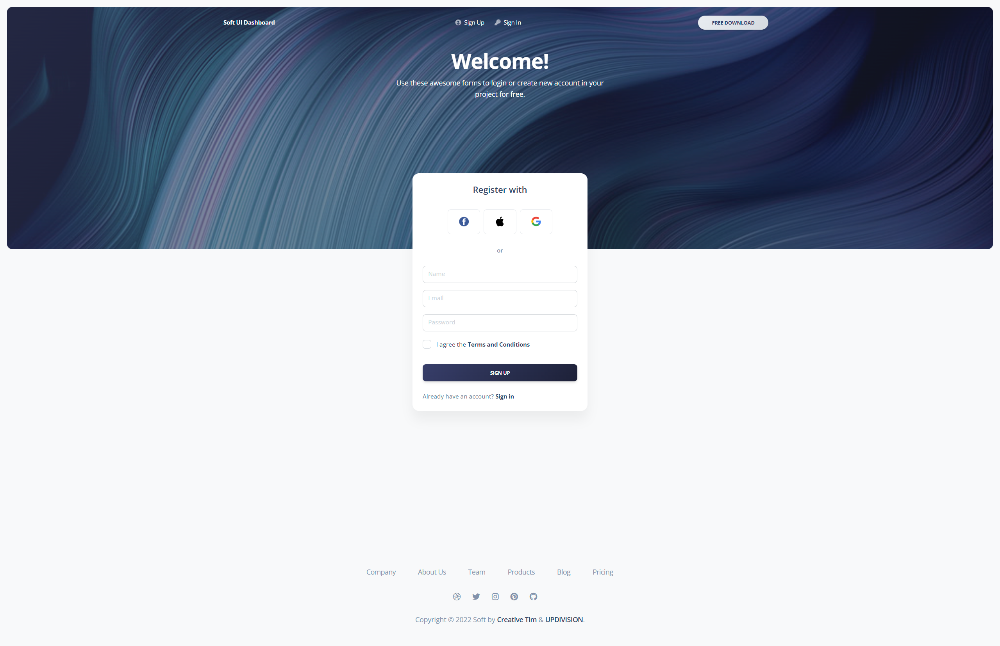
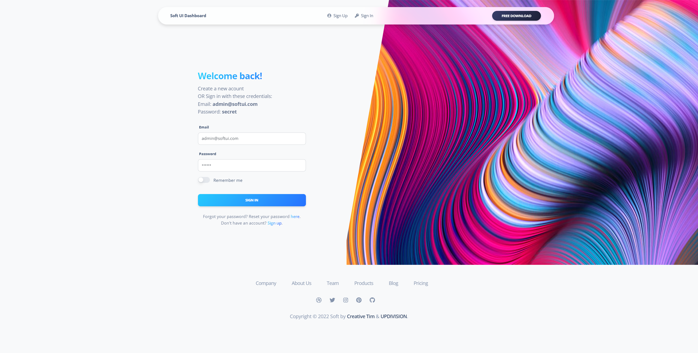
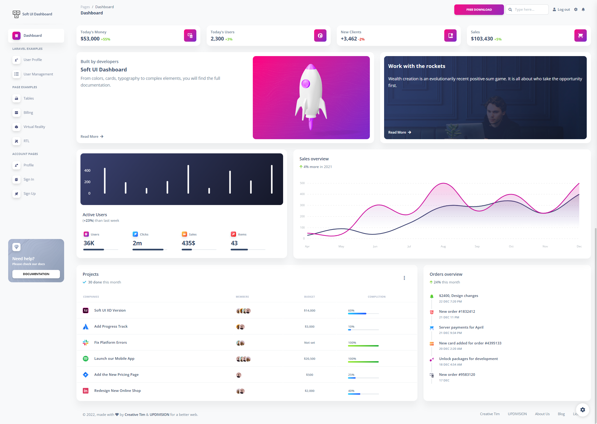
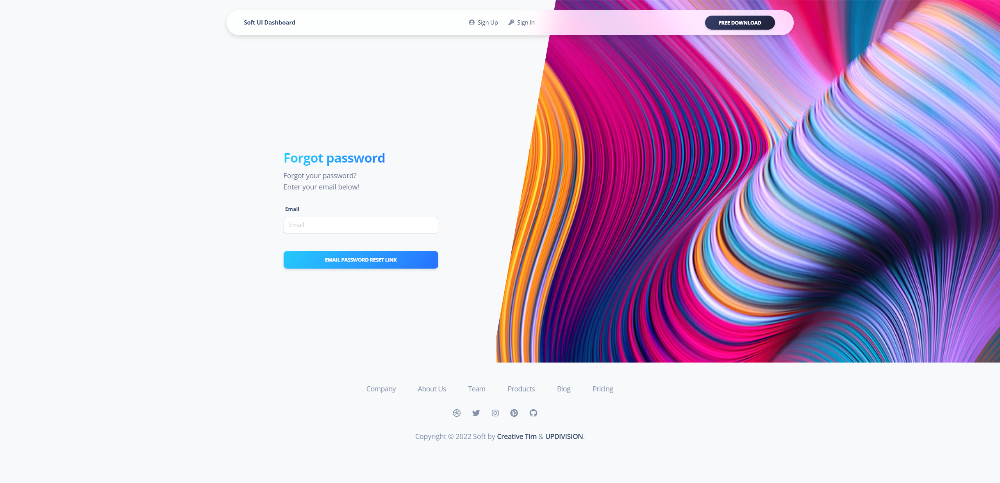
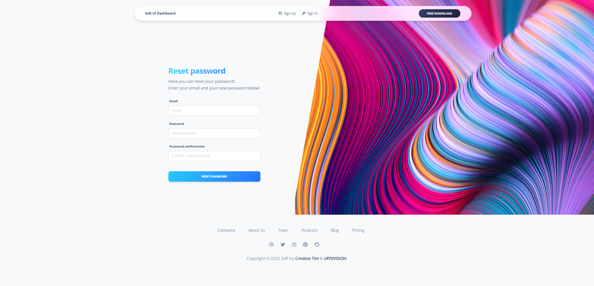
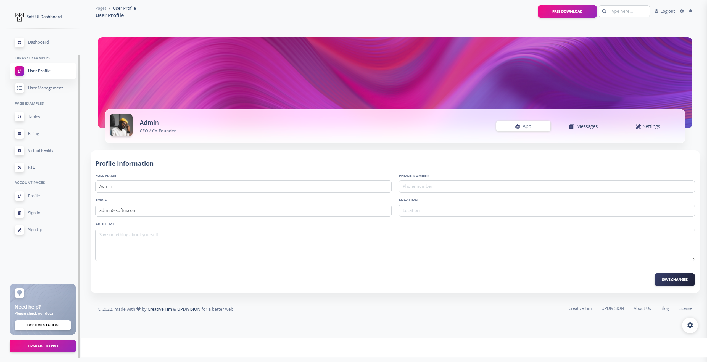

# [Soft UI Dashboard TALL Free](https://soft-ui-dashboard-tall.creative-tim.com/)

 

[](https://github.com/creativetimofficial/soft-ui-dashboard-tall/issues?q=is%3Aopen+is%3Aissue) 
[](https://github.com/creativetimofficial/soft-ui-dashboard-tall/issues?q=is%3Aissue+is%3Aclosed)

*Frontend version*: Soft UI Dashboard Tailwind v1.0.3. More info at https://www.creative-tim.com/product/soft-ui-dashboard-tailwind
[ ](https://soft-ui-dashboard-tall.creative-tim.com/)

Speed up your web development with the Tailwind Admin Dashboard built for Laravel Framework 9.x and up.

If you want to get more features, go PRO with [Soft UI Dashboard PRO Tall](https://www.creative-tim.com/product/soft-ui-dashboard-pro-tailwind).

## Table of Contents
* [Prerequisites](#prerequisites)
* [Installation](#installation)
* [Usage](#usage)
* [Versions](#versions)
* [Demo](#demo)
* [Documentation](#documentation)
* [Login](#login)
* [Register](#register)
* [Forgot Password](#forgot-password)
* [Reset Password](#reset-password)
* [User Profile](#user-profile)
* [Dashboard](#dashboard)
* [File Structure](#file-structure)
* [Browser Support](#browser-support)
* [Reporting Issues](#reporting-issues)
* [Licensing](#licensing)
* [Useful Links](#useful-links)
* [Social Media](#social-media)
* [Credits](#credits)

## Prerequisites

If you don't already have an Apache local environment with PHP and MySQL, use one of the following links:

 - Windows: https://updivision.com/blog/post/beginner-s-guide-to-setting-up-your-local-development-environment-on-windows
 - Linux & Mac: https://updivision.com/blog/post/guide-what-is-lamp-and-how-to-install-it-on-ubuntu-and-macos

Also, you will need to install Composer: https://getcomposer.org/doc/00-intro.md   
And Laravel: https://laravel.com/docs/10.x


## Installation
1. Unzip the downloaded archive
2. Copy and paste **soft-ui-dashboard-tall-main** folder in your **projects** folder. Rename the folder to your project's name
3. In your terminal run `composer install`
4. Copy `.env.example` to `.env` and updated the configurations (mainly the database configuration and email credentials, also do not forget to also change APP_URL as it is used in some of the files)
5. In your terminal run `php artisan key:generate`
6. Run `php artisan migrate --seed` to create the database tables and seed the roles and users tables
7. Run `php artisan storage:link` to create the storage symlink (if you are using **Vagrant** with **Homestead** for development, remember to ssh into your virtual machine and run the command from there).


## Usage
Register a user or login with default user **admin@softui.com** and password **secret** from your database and start testing (make sure to run the migrations and seeders for these credentials to be available).

Besides the dashboard, the auth pages, the billing and table pages, there is also has an edit profile page. All the necessary files are installed out of the box and all the needed routes are added to `routes/web.php`. Keep in mind that all of the features can be viewed once you login using the credentials provided or by registering your own user. 


## Versions

[](https://www.creative-tim.com/product/soft-ui-dashboard-tailwind)
[](https://www.creative-tim.com/product/soft-ui-dashboard-laravel)


| HTML Tailwind | Laravel | TALL Stack |
| --- | --- | --- |
| [](https://www.creative-tim.com/product/soft-ui-dashboard-tailwind) | [](https://www.creative-tim.com/product/soft-ui-dashboard-laravel)  | [](https://www.creative-tim.com/product/soft-ui-dashboard-tall)  |


## Demo
| Register | Login | Dashboard |
| --- | --- | ---  |
| [](https://soft-ui-dashboard-tall.creative-tim.com/register) | [](https://soft-ui-dashboard-tall.creative-tim.com/login)  | [](https://soft-ui-dashboard-tall.creative-tim.com/dashboard)

| Forgot Password Page | Reset Password Page | Profile Page  |
| --- | --- | ---  |
| [](https://soft-ui-dashboard-tall.creative-tim.com/login/forgot-password)  | [](https://soft-ui-dashboard-tall.creative-tim.com/login) | [](https://soft-ui-dashboard-tall.creative-tim.com/user-profile)
[View More](https://soft-ui-dashboard-tall.creative-tim.com/dashboard)

## Documentation
The documentation for the Soft UI Dashboard TALL is hosted at our [website](https://www.creative-tim.com/learning-lab/tailwind/html/quick-start/soft-ui-dashboard/).

### Login
If you are not logged in you can only access this page or the Sign Up page. The default url takes you to the login page where you use the default credentials **admin@softui.com** with the password **secret**. Logging in is possible only with already existing credentials. For this to work you should have run the migrations. 

The `App/Http/Livewire/Auth/Login.php` handles the logging in of an existing user.

```
    public function login()
    {
        if (auth()->attempt(['email' => $this->email, 'password' => $this->password], $this->remember_me)) {
            $user = User::where(["email" => $this->email])->first();
            auth()->login($user, $this->remember_me);
            return redirect()->intended('/dashboard');
        } else {
            return $this->addError('email', trans('auth.failed'));
        }
    }
```

### Register
You can register as a user by filling in the name, email and password for your account. You can do this by accessing the sign up page from the "**Sign Up**" button in the top navbar or by clicking the "**Sign Up**" button from the bottom of the log in form.. Another simple way is adding **/register** in the url.

The `App/Http/Livewire/Auth/Register.php` handles the registration of a new user.

```
    public function register()
    {
        $this->validate();
        $user = User::create([
            'name' => $this->name,
            'email' => $this->email,
            'password' => Hash::make($this->password)
        ]);

        auth()->login($user);

        return redirect('/dashboard');
    }

```

### Forgot Password
If a user forgets the account's password it is possible to reset the password. For this the user should click on the "**here**" under the login form.

The `App/Http/Livewire/Auth/ForgotPassword.php` takes care of sending an email to the user where he can reset the password afterwards.

```
    public function recoverPassword()
    {
        $this->validate();
        $user = User::where('email', $this->email)->first();
        if ($user) {
            $this->notify(new ResetPassword($user->id));
            return back()->with('status', "An email for resetting your password has been sent!");
        } else {
            return back()->with('email', "We could not find any user with that email address.");
        }
    }
```

### Reset Password
The user who forgot the password gets an email on the account's email address. The user can access the reset password page by clicking the button found in the email. The link for resetting the password is available for 12 hours. The user must add the email, the password and confirm the password for his password to be updated.

The `App/Http/Livewire/Auth/ResetPassword.php` helps the user reset the password.

```
    public function resetPassword()
    {
        $this->validate();
        $existingUser = User::where('email', $this->email)->first();
        if ($existingUser && $existingUser->id == $this->urlID) {
            $existingUser->update([
                'password' => Hash::make($this->password)
            ]);
            redirect('login')->with('status', 'Your password has been reset!');
        } else {
            return back()->with('email', "We could not find any user with that email address.");
        }
    }
```

### User Profile
The profile can be accessed by a logged in user by clicking "**User Profile**" from the sidebar or adding **/user-profile** in the url. The user can add information like phone number, location, description or change the name and email.

The `App/Http/Livewire/LaravelExamples/UserProfile.php` handles the user's profile information.

```
    public function save()
    {
        $this->validate();

        $this->user->save();

        return back()->with('status', "Your profile information have been successfully saved!");
    }
```

### Dashboard
You can access the dashboard either by using the "**Dashboard**" link in the left sidebar or by adding **/dashboard** in the url after logging in. 

## File Structure
```
+---app
|   +---Console
|   |       Kernel.php
|   +---Exceptions
|   |       Handler.php
|   +---Http
|   |   +---Controllers
|   |   |       Controller.php
|   |   |       
|   |   +---Middleware
|   |   |       Authenticate.php
|   |   |       EncryptCookies.php
|   |   |       PreventRequestsDuringMaintenance.php
|   |   |       RedirectIfAuthenticated.php
|   |   |       TrimStrings.php
|   |   |       TrustHosts.php
|   |   |       TrustProxies.php
|   |   |       VerifyCsrfToken.php
|   |   |
|   |   +---Livewire
|   |   |   | 
|   |   |   +---Auth
|   |   |   |     ForgotPassword.php
|   |   |   |     Login.php
|   |   |   |     Logout.php
|   |   |   |     Register.php
|   |   |   |     ResetPassword.php
|   |   |   | 
|   |   |   +---LaravelExamples 
|   |   |   |     UserManagement.php
|   |   |   |     UserProfile.php
|   |   |   |
|   |   |   |   Billing.php
|   |   |   |   Dashboard.php
|   |   |   |   Notifications.php
|   |   |   |   Profile.php
|   |   |   |   RTL.php
|   |   |   |   StaticSignIn.php
|   |   |   |   StaticSignUp.php
|   |   |   |   Tables.php
|   |   |   \   VirtualReality.php
|   |   |   
|   |    \---Kernel.php   
|   |   
|   +---Models
|   |        User.php
|   |
|   +---Notifications
|   |        ResetPassword.php
|   |     
|   |---Proviers
|   |      AppServiceProvider.php
|   |      AuthServiceProvider.php
|   |      BroadcastServiceProvider.php
|   |      EventServiceProvider.php
|   |      RouteServiceProvider.php
|   | 
|   \---View
|          App.php
|          Base.php
|   
....

```

## Browser Support
At present, we officially aim to support the last two versions of the following browsers:

    


## Reporting Issues
We use GitHub Issues as the official bug tracker for the Soft UI Dashboard TALL. Here are some advices for our users that want to report an issue:

1. Make sure that you are using the latest version of the Soft UI Dashboard TALL. Check the CHANGELOG from your dashboard on our [website](https://www.creative-tim.com/product/soft-ui-dashboard-tall).
2. Providing us reproductible steps for the issue will shorten the time it takes for it to be fixed.
3. Some issues may be browser specific, so specifying the browser you encountered the issue on might help.


## Licensing
- Copyright 2022 [Creative Tim](https://www.creative-tim.com?ref=readme-softuitall)
- Creative Tim [license](https://www.creative-tim.com/license?ref=readme-softuitall)

## Useful Links
- [Tutorials](https://www.youtube.com/channel/UCVyTG4sCw-rOvB9oHkzZD1w)
- [Affiliate Program](https://www.creative-tim.com/affiliates/new) (earn money)
- [Blog Creative Tim](http://blog.creative-tim.com/)
- [Free Products](https://www.creative-tim.com/bootstrap-themes/free) from Creative Tim
- [Premium Products](https://www.creative-tim.com/bootstrap-themes/premium?ref=softuitall-readme) from Creative Tim
- [React Products](https://www.creative-tim.com/bootstrap-themes/react-themes?ref=softuitall-readme) from Creative Tim
- [VueJS Products](https://www.creative-tim.com/bootstrap-themes/vuejs-themes?ref=softuitall-readme) from Creative Tim
- [More products](https://www.creative-tim.com/bootstrap-themes?ref=softuitall-readme) from Creative Tim
- Check our Bundles [here](https://www.creative-tim.com/bundles??ref=softuitall-readme)

### Social Media

### Creative Tim
Twitter: <https://twitter.com/CreativeTim?ref=softuitall-readme>

Facebook: <https://www.facebook.com/CreativeTim?ref=softuitall-readme>

Dribbble: <https://dribbble.com/creativetim?ref=softuitall-readme>

Instagram: <https://www.instagram.com/CreativeTimOfficial?ref=softuitall-readme>

### Updivision:

Twitter: <https://twitter.com/updivision?ref=softuitall-readme>

Facebook: <https://www.facebook.com/updivision?ref=softuitall-readme>

Linkedin: <https://www.linkedin.com/company/updivision?ref=softuitall-readme>

UPDIVISION Blog: <https://updivision.com/blog/?ref=softuitall-readme>

## Credits

- [Creative Tim](https://creative-tim.com/?ref=softuitall-readme)
- [UPDIVISION](https://updivision.com/?ref=softuitall-readme)
